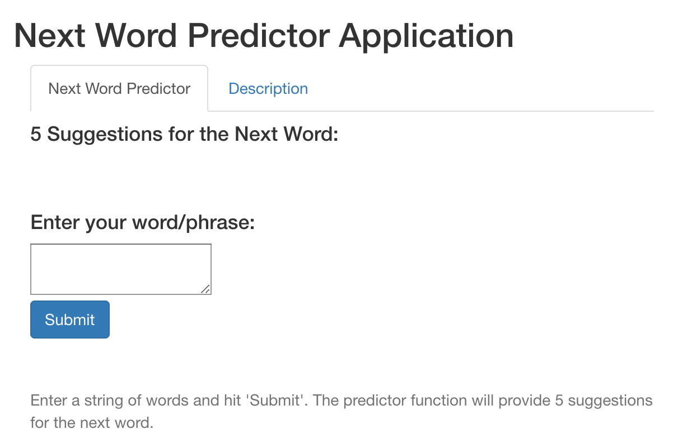

## Objectives

- Develop a next word prediction algorithm using the data provided from [here](https://d396qusza40orc.cloudfront.net/dsscapstone/dataset/Coursera-SwiftKey.zip).  
- Apply algorithm to a shiny app for web use.

### Special Considerations
- Algorithm should be efficient as well as accurate.  
    - This includes file size and computation time.
    

## Models Creation
- Downloaded data was subset for training & test sets to develop and apply the algorithms, respectively.  
- The subset text was cleaned to make token and ngram searching less ambiguous and more uniform.
- ngrams from unigrams (unique one-word strings) to quadgrams (unique four-word strings) were created.
- A comparison was done between two predictive models:  
      - One that based its prediction on Kneser-Ney smoothing probabilities  
      - One that based its prediction on the frequency/count of ngram appearance


## Results
- The Kneser-Ney smoothing probability prediction algorithm had an accuracy <1% greater than that of the frequency/count prediction algorithm.  
- The probability prediction algorithm took 28.83 minutes to predict the first 1000 lines of the test data, while the frequency/count prediction algorithm only took 3.33 minutes.  
- The difference in data file/variable file size is significant, with the probability predictors being 10x larger for quadgrams than the frequency/count equivalents.  
- **The frequency/count prediction algorithm is recommended and used for it's reduced size and computation time with minimal loss of accuracy.**

Full methods documentation can be found [here](https://rpubs.com/jepanzik/DSCPFinal)

## Shiny App
The shiny app can be found [here](https://jepanzik.shinyapps.io/NextWordPredictor/)

- The prediction algorithm for this app counts the number of words entered then relies on a sequential ngram search that starts at the number of words minus one (n-1), with a max of quadgrams for effieciency.  
- It then searches sequentially through the frequency/count predictor data into lower ngrams until 5 unique possible next words are retrieved.

```{r  out.width = "40%", echo=FALSE}
library(knitr)
 
```

